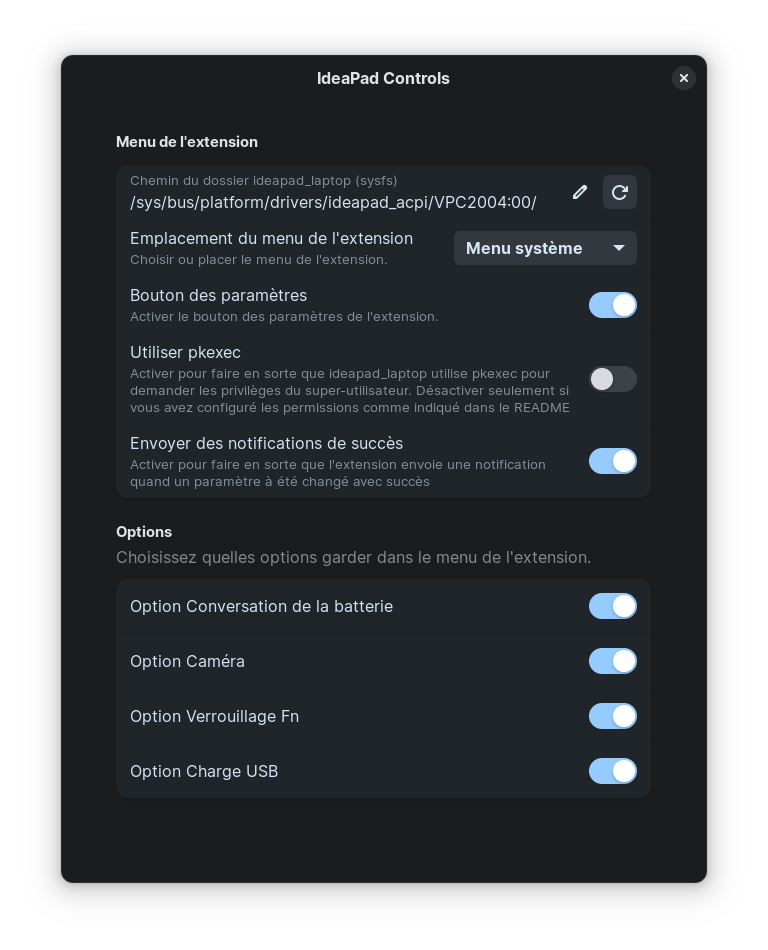
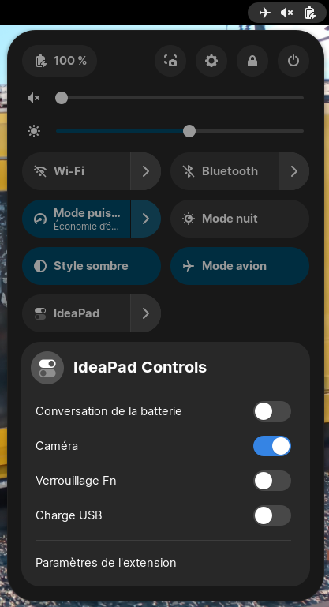

# ideapad-controls-gnome-extension
GNOME Shell extension for controling Lenovo IdeaPad laptops options.

**Available options:** Conservation Mode, Camera Lock, Fn Lock, Touchpad Lock, USB charging.

**Settings window:**

**Tray mode:**

**System menu mode:**

# Installation

## GNOME Extensions
Install from [GNOME Extensions](https://extensions.gnome.org/extension/5260/ideapad-controls/).

## Manual
Clone the repo then execute `install.sh` script.
